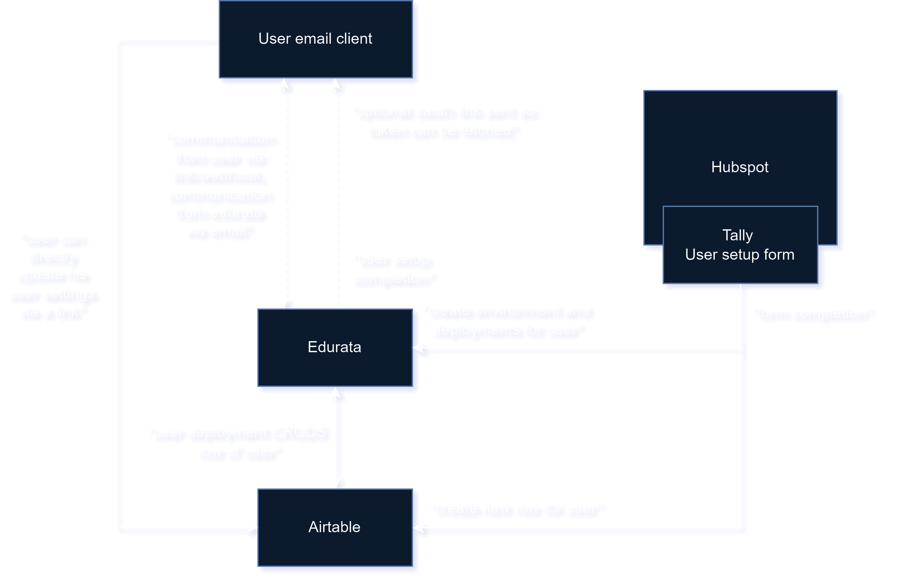

# Micro Apps with edurata

[Micro](https://blog.dreamfactory.com/what-is-a-micro-app-monitoring-an-emerging-trend) apps are the idea of keeping the functionality of a software service as concise and affordable as possible. A micro app usually only does one but important task. The IT architecture is also kept to a minimum. It uses mainly SaaS Solutions in the background and links in emails for interaction, without any user login.

## Architecture
All micro apps follow the same minimalist stack. 

### Backend:
- **Airtable**: Saving user settings + user data
- **Edurata**: for execution of logic and storing of user secrets and handling oauth

### Frontend:
- **Hubspot**: For having a landing page on which a tally form is.
- **tally**: for handling first user setup and triggering a webhook to create a new user in edurata.
- **Airtable Interface**: For updating user settings the user receives a link to an airtable form/interface where they can update their settings.
- **Email**: For other push interactions and notifications the users email is used.

## Edurata Details

- In almost all micro apps an oauth connection is needed to the user account. In order to realise that in edurata one or more deployments per user are created and one environment with the user's email. The oauth secrets are then stored in the environment of the user and can be used in the deployments.
- The deployments are then triggered either on a schedule or by a webhook. The webhook can be triggered by a third party or by the user clicking on a link in an email.
- For user setup and some common actions like canceling the subscription or updating the user settings there are workflows available in the `general` folder.

## Airtable Details

- Airtable is a database SaaS that is used to store user settings and user data of the microapps.
- There is one user table + an update user table and an automation to trigger a change on the user table if an entry in the update user table is added as described [here](https://support.airtable.com/docs/update-record-action)

